| [Home](../README.md) |
| -------------------- |

# Usage

Refer to the subsequent sections to understand how this solution pack's automation addresses your needs.

- [Usage](#usage)
  - [Simulation](#simulation)
    - [NERC CIP-002 BES Cyber Systems Sample Record](#nerc-cip-002-bes-cyber-systems-sample-record)
      - [Actions](#actions)
  - [BES Cyber Asset Categorization](#bes-cyber-asset-categorization)
  - [Schedule](#schedule)
    - [NERC CIP 002-5.1a: BES Impact Evaluation - Violations](#nerc-cip-002-51a-bes-impact-evaluation---violations)
    - [NERC CIP 002-5.1a: BES Impact Evaluation - Reminder](#nerc-cip-002-51a-bes-impact-evaluation---reminder)
  - [Dashbaord](#dashbaord)
- [Next Steps](#next-steps)

## Simulation

To understand the process FortiSOAR&trade; follows to respond to **BES Cyber System Impact Evaluation**, we have included following scenarios with this solution pack:-
 - NERC CIP-002 BES Cyber Systems Sample Record

Refer to [Simulate Scenario documentation](https://github.com/fortinet-fortisoar/solution-pack-soc-simulator/blob/develop/docs/usage.md) to understand how to simulate and reset scenarios.

### NERC CIP-002 BES Cyber Systems Sample Record

This scenario generates 3 Bulk Electric System (BES) Cyber System records have been created, capturing essential information such as the Entity type and the associated Digital Control System.   These records enable users to correlate assets within the electric grid infrastructure. Additionally, a user-friendly interface includes an **Evaluate Impact** button, empowering users to trigger the calculation of BES Impact.

To run this scenario and generate the assets, perform the following steps:

1. Under the FortiSOAR&trade;'s left navigation panel, select to open **Simulations**.

2. Select the scenario **NERC CIP-002 BES Cyber Systems Sample Record**.

3. Click **Simulate Scenario**.

4. To view the added sample BES Cyber System, hover over **OT Compliance** under the FortiSOAR&trade;'s left navigation panel, and select **BES Cyber System**.

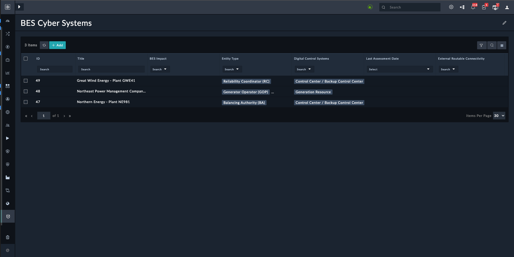

#### Actions

Here is a set of actions crafted to compliance with **R1** of [NERC CIP 002-5.1a](https://www.nerc.com/pa/Stand/Reliability%20Standards/CIP-002-5.1a.pdf)

1. Open any of the record and correlate Associated Assets under **Assets** tab.
   
    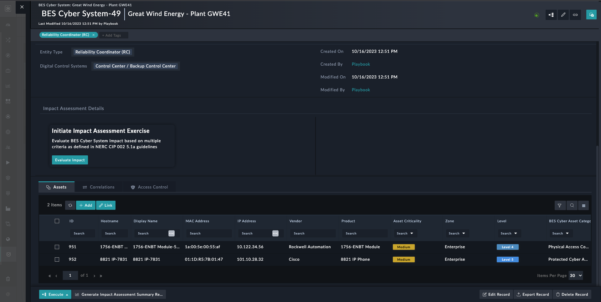

2. To evaluate BES Impact, click on **Evaluate Impact** button.
   
    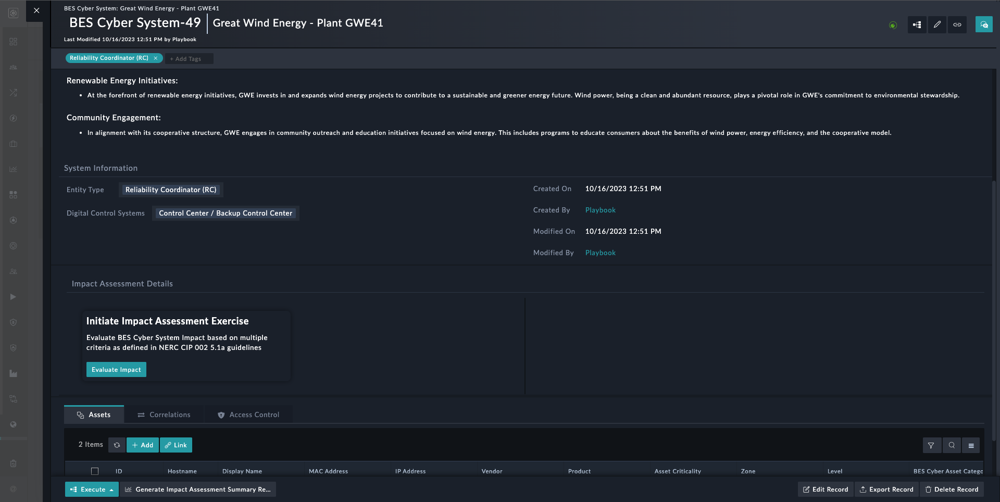

3. The following steps of the wizard will appear:
   
   1. **Start**: Begin the evaluation by clicking on *Let's start by viewing associated Assets*
            
        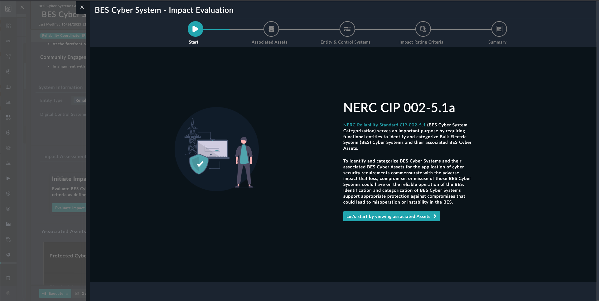

   2. **Associated Assets**: List down all associated assets, and feel free to include notes for additional details.
    
        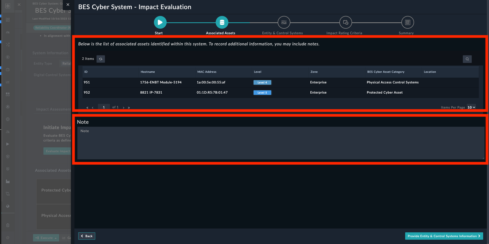

   3. **Entity & Control Systems**: Display the **Entity Types** and **Digital Control Systems** of records, providing options to modify both Entity Type and **Digital Control Systems.
        
        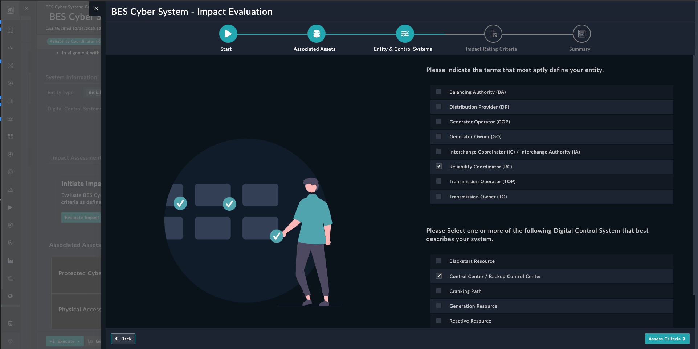

   4. **Impact Rating Criteria**: Illustrates the impact rating criteria based on the selected Entity Type and Digital Control System in accordance with [NERC CIP 002-5.1a](https://www.nerc.com/pa/Stand/Reliability%20Standards/CIP-002-5.1a.pdf), as outlined in CIP-002-5.1a - Attachment 1.
   
        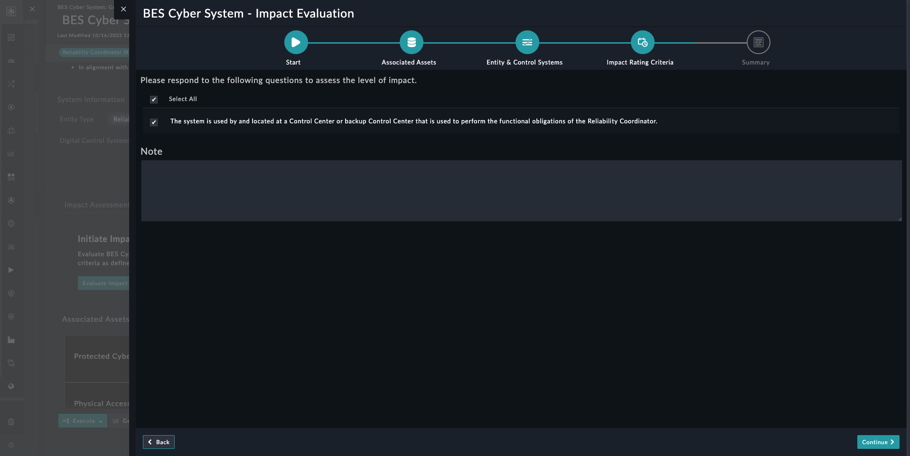

   5. **Summary**: Capture all the given inputs and the Evaluated Impact Level.
    
        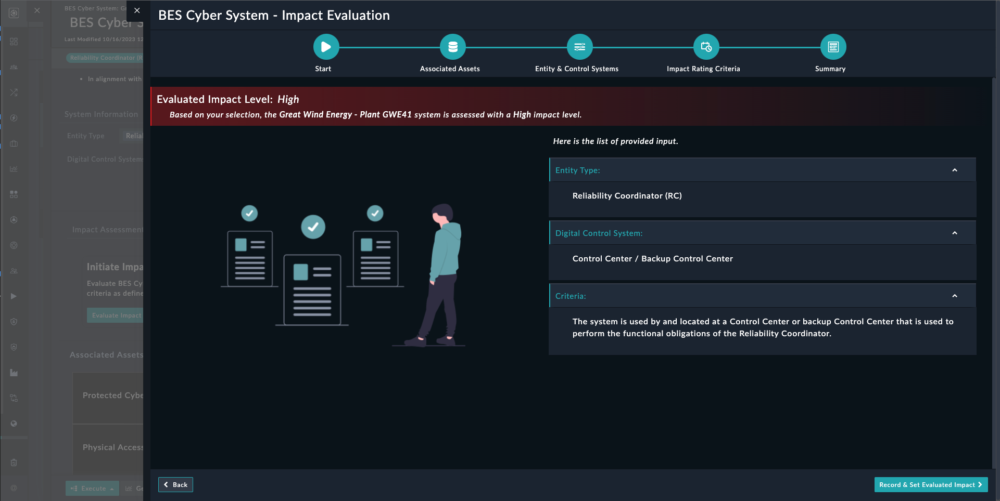

4. Click on **Record & Set Evaluated Impact** to record all the input and Evaluated Impact Level.

5. A comment is added to the record for the provided input and Evaluated Impact Level, labeled as *Details of the last Impact Level Assessment*
    
    

<table>
    <tr>
        <td><strong>Note</strong></td>
        <td>To generate the report, click <strong>Generate Impact Assessment Summary Report</strong> button. The report is attached to the comment, under the Workspace panel, associated with that record.</td>
    </tr>
</table>

## BES Cyber Asset Categorization

Here, we'll learn how to label an **Asset** based on the BES Cyber Category.

1. Find the asset by hovering to **Resources** in the left menu of FortiSOAR&trade; and select **Assets**.
2. Click on the **Executes** button for that asset.
3. Run the playbook name **Assign BES Cyber System Category**.
4. A box will appear asking you to choose the `Asset Type` and provide a `Reason` (which is necessary).

    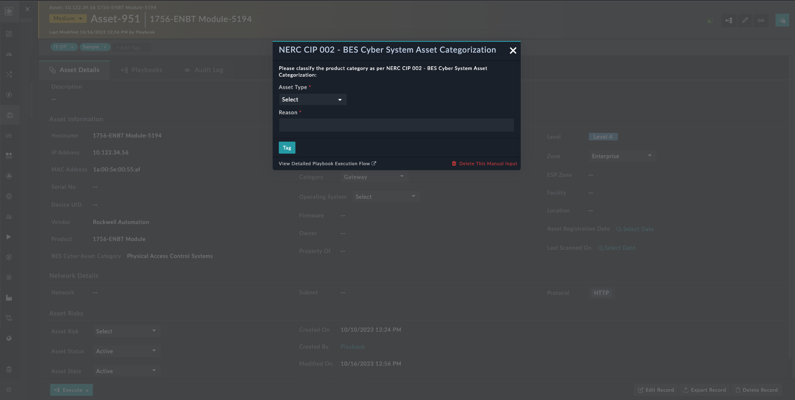
5. Enter the information and click on **Tag**.
6. The record will now show the chosen type, and a comment will be added.

## Schedule

Here is a set of schedules designed to adhere to **R2** of [NERC CIP 002-5.1a](https://www.nerc.com/pa/Stand/Reliability%20Standards/CIP-002-5.1a.pdf)

### NERC CIP 002-5.1a: BES Impact Evaluation - Violations
   - Schedule involves sending emails that list all the BES Impact Non-Evaluated Cyber Systems.
   - To configure send to list:
     - Open Playbook Collection named **02 - Use Case - NERC CIP 002**
     - Access the playbook titled **BES Impact Evaluation - Violations**
     - Under the configuration step, provide a comma-separated list of users in fields `sendTo` as shown in the image:
  
        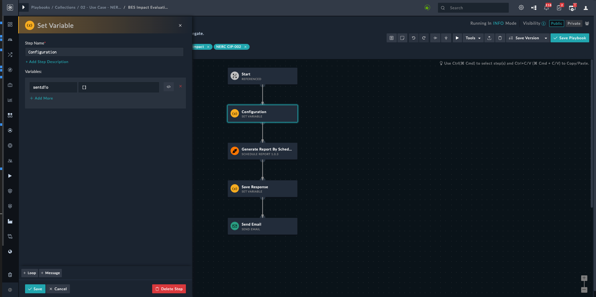

### NERC CIP 002-5.1a: BES Impact Evaluation - Reminder
   - Schedule sends reminders for all BES Cyber Systems whose evaluation was conducted over a year ago.
   - To configure send to list:
     - Open Playbook Collection named **02 - Use Case - NERC CIP 002**
     - Access the playbook titled **BES Impact Evaluation - Reminder**
     - Under the configuration step, provide a comma-separated list of users in fields `sendTo` as shown in the image:
  
        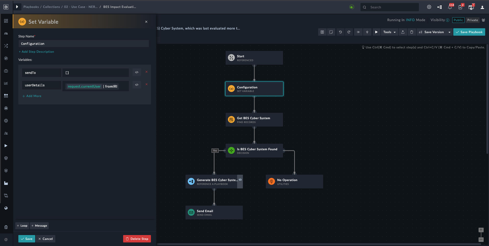

<table>
    <tr>
        <td><strong>NOTE</strong></td>
        <td>By Default sets of schedules are <em>Inactive</em></td>
    </tr>
</table>

## Dashbaord

On the NERC CIP 002-5.1a compliance dashboard, include an element that provides an overview of BES Cyber Systems. 

To open the dashboard, perform the following steps:

1. Under the FortiSOAR&trade;'s left navigation panel, select to open **Dashboard**.

2. Select the dashboard **NERC CIP 002-5.1a - BES Cyber System Categorization**.

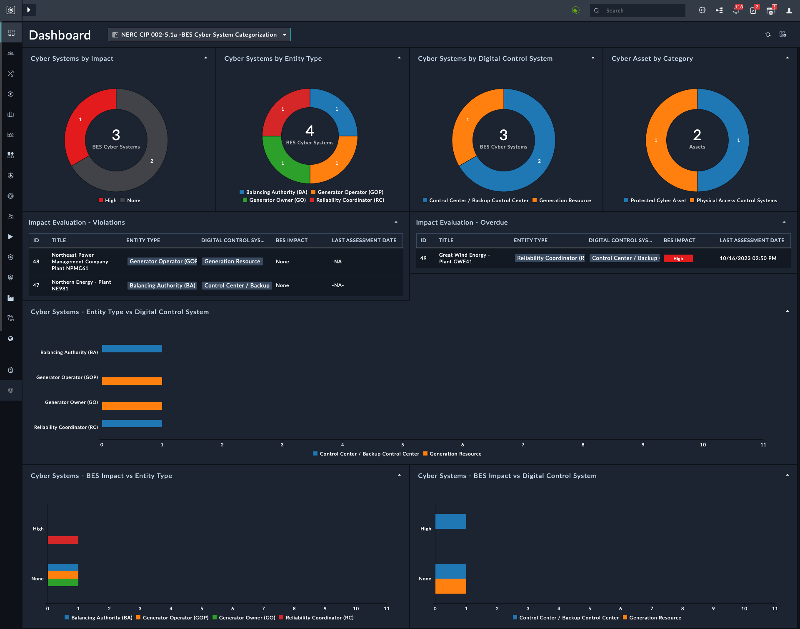

# Next Steps
| [Installation](./setup.md#installation) | [Configuration](./setup.md#configuration) | [Contents](./contents.md) |
| --------------------------------------- | ----------------------------------------- | ------------------------- |