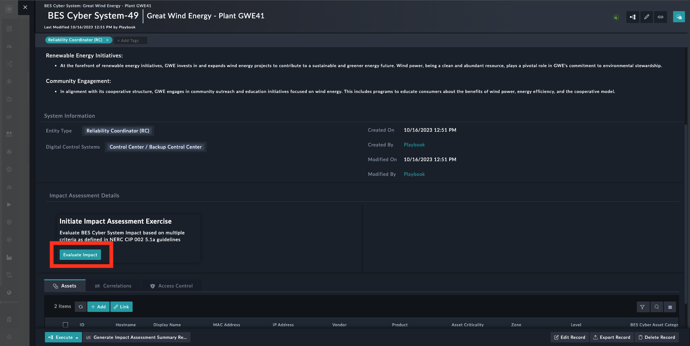
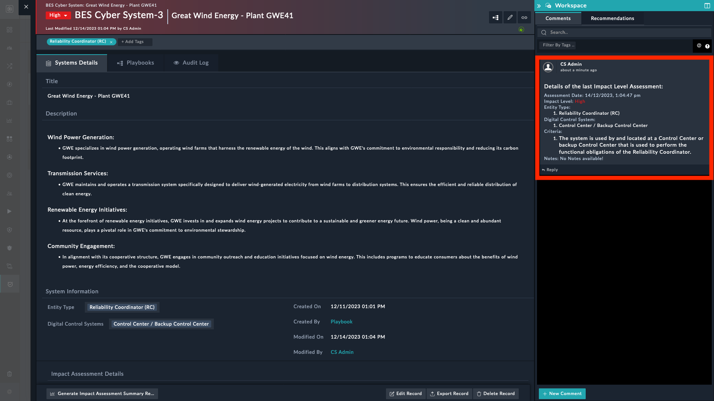

| [Home](../README.md) |
| -------------------- |

# Usage

<!-- Refer to the subsequent sections to understand how this solution pack's automation addresses your needs.

- [Usage](#usage)
  - [Simulation](#simulation)
    - [NERC CIP-002 BES Cyber Systems Sample Record](#nerc-cip-002-bes-cyber-systems-sample-record)
      - [Actions](#actions)
  - [BES Cyber Asset Categorization](#bes-cyber-asset-categorization)
  - [Schedule](#schedule)
    - [NERC CIP 002-5.1a: BES Impact Evaluation - Violations](#nerc-cip-002-51a-bes-impact-evaluation---violations)
    - [NERC CIP 002-5.1a: BES Impact Evaluation - Reminder](#nerc-cip-002-51a-bes-impact-evaluation---reminder)
  - [Dashboard](#dashbaord)
- [Next Steps](#next-steps)

## Simulation
 -->
To understand the process FortiSOAR&trade; follows for **BES Cyber System Impact Evaluation**, we have included the following scenario with this solution pack:-

- NERC CIP-002 BES Cyber Systems Sample Record

Refer to [Simulate Scenario documentation](https://github.com/fortinet-fortisoar/solution-pack-soc-simulator/blob/develop/docs/usage.md) to understand how to simulate and reset scenarios.

## Scenario - NERC CIP-002 BES Cyber Systems Sample Record

This scenario generates 3 Bulk Electric System (BES) Cyber System records, capturing essential information such as the **Entity type** and the associated **Digital Control System**.

These records help users correlate assets within the electric grid infrastructure. Additionally, a user-friendly interface includes an **Evaluate Impact** button, to trigger the calculation of BES Impact.

To run this scenario and generate the assets, perform the following steps:

1. Select to open **Simulations** from FortiSOAR&trade;'s left navigation panel.

2. Select the scenario **NERC CIP-002 BES Cyber Systems Sample Record**.

3. Click **Simulate Scenario**.

4. Hover over **OT Compliance** under the FortiSOAR&trade;'s left navigation panel, and select **BES Cyber System** to view the added sample BES Cyber Systems.

    

### Actions

Following is a set of actions crafted to comply with **R1** of [NERC CIP 002-5.1a](https://www.nerc.com/pa/Stand/Reliability%20Standards/CIP-002-5.1a.pdf)

1. **_Correlate Assets_**: Correlate associated assets with a record under **Assets** tab.

    1. Open a record. For example, `Great Wind Energy - Plant GWE41`.

        

    2. Click the button **+Add** to add a new asset.

        

        Alternatively, use the button **Link** to link the open record with an existing asset.

        

    The following image shows the associated assets in `Great Wind Energy - Plant GWE41` record.
 
    

2. **_Evaluate Impact_**: Click the **Evaluate Impact** button to launch the **BES Cyber System - Impact Evaluation** wizard.
   
    
   
   1. **Start**: Begin the evaluation by clicking *Let's start by viewing associated Assets*
            
        

   2. **Associated Assets**: Review the list of associated assets and include notes, in the **Note** field, for additional details. Click the button **Provide Entity & Control Systems Information** to continue.
    
        

   3. **Entity & Control Systems**: Review and select applicable entity and digital control systems type and click the button **Access Criteria** to proceed.
        
        

   4. **Impact Rating Criteria**: Select applicable statements to assess the level of impact based on the selected **Entity Type** and **Digital Control System**, as outlined in [NERC CIP-002-5.1a - Attachment 1](https://www.nerc.com/pa/Stand/Reliability%20Standards/CIP-002-5.1a.pdf). Click **Continue** to proceed.
   
        

   5. **Summary**: Review the impact assessment information. Click the button **Back** to make changes, or **Record & Set Evaluated Impact** to proceed.
    
        

A comment is added to the record for the provided input and Evaluated Impact Level, labeled as *Details of the last Impact Level Assessment*
    

<table>
    <tr>
        <th>NOTE</th>
        <td>To generate the report, click <strong>Generate Impact Assessment Summary Report</strong> button. The report is attached to the comment, under the Workspace panel, associated with that record.</td>
    </tr>
    <tr>
        <td colspan="2"></td>
    </tr>
</table>

## BES Cyber Asset Categorization

This section details how to label an **Asset** based on the BES Cyber Category.

1. Hover over **Resources** in the FortiSOAR&trade;'s left navigation menu and select **Assets**.

2. Select an asset.

3. Click **Execute** and select **Assign BES Cyber System Category** to run the playbook.

4. Select an asset type  in the **Asset Type** field. Specify a reason for the selected categorization in the **Reason** field.

    

5. Click **Tag** after entering the information to tag the asset with the selected category.

The asset details record now displays the **BES Cyber Asset Category** field with the value you selected.

## Schedule

Following is a set of schedules that help adhere to **R2** of [NERC CIP 002-5.1a](https://www.nerc.com/pa/Stand/Reliability%20Standards/CIP-002-5.1a.pdf).

- NERC CIP 002-5.1a: BES Impact Evaluation - Violations

- NERC CIP 002-5.1a: BES Impact Evaluation - Reminder

### NERC CIP 002-5.1a: BES Impact Evaluation - Violations

This schedule sends emails listing all the Impact Non-Evaluated Cyber Systems. You can configure the recipient's list as follows:

1. Open the **02 - Use Case - NERC CIP 002** playbook collection. 

2. Click to open the **BES Impact Evaluation - Violations** playbook

3. Edit the **_Configuration_** step and specify a comma-separated list of users in the `sendTo` field:
  
    

### NERC CIP 002-5.1a: BES Impact Evaluation - Reminder

This schedule sends reminders to specified recipients about BES Cyber Systems whose evaluation was conducted over a year ago. You can configure the recipient's list as follows:

1. Open the **02 - Use Case - NERC CIP 002** playbook collection. 

2. Click to open the **BES Impact Evaluation - Reminder** playbook

3. Edit the **_Configuration_** step and specify a comma-separated list of recipients in the `sendTo` field:
  
    

<table>
    <tr>
        <th>NOTE</th>
        <td>By Default, these schedule sets are <em>Inactive</em>.</td>
    </tr>
</table>

## Dashboard

The **NERC CIP 002-5.1a compliance** dashboard includes elements that provide an overview of BES Cyber Systems. 

To open the dashboard, perform the following steps:

1. Under the FortiSOAR&trade;'s left navigation panel, select to open **Dashboard**.

2. Select the dashboard **NERC CIP 002-5.1a - BES Cyber System Categorization**.

# Next Steps
| [Installation](./setup.md#installation) | [Configuration](./setup.md#configuration) | [Contents](./contents.md) |
| --------------------------------------- | ----------------------------------------- | ------------------------- |